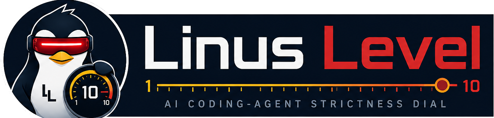

# Linus Level Skill

[](https://github.com/rsoffer/linus-level-skill/tags)
[](./LICENSE)
[](./skills/linus-level/SKILL.md)
[](#copy-paste-install-prompts)



**Linus Level** gives coding agents like Codex, Claude, and other `SKILL.md`-aware workflows a `1.0-10.0` strictness dial for software work: from creative vibe-mode prototyping to careful maintainer-grade engineering.

The name is a software-culture wink to Linus Torvalds' reputation for exacting technical standards and maintainer seriousness. It is not about harsh communication. It is about giving agents a memorable control for how much freedom, skepticism, verification, security discipline, and code-review strictness a task deserves.

## The Problem

AI coding agents are asked to behave in wildly different contexts:

- "Vibe-code this idea into existence." ⚡
- "Prototype a weird UI direction quickly." ✨
- "Patch a production codebase without breaking contracts." 🛠️
- "Touch auth, data, security, infra, or business rules safely." 🔒

Without calibration, an agent may guess wrong. It may over-engineer a throwaway sketch, or worse, treat a mission-critical production system like a loose prototype.

Linus Level makes the expected behavior explicit.

## ⚡ Quick Start

```text
Use $linus-level at Linus Level 8.5 for this production codebase task.
```

```text
Use Linus Level 2 for fast creative prototyping.
```

```text
Calibrate this task with Linus Level before coding.
```

## 🎛️ The Dial

| Linus Level | Mode | Agent Behavior |
|---:|---|---|
| `1.0-1.9` | Vibe mode | Take the lead and ask almost nothing, but still inventory assumptions and include the question checkpoint. |
| `2.0-2.9` | Hack/sketch | Build the thing fast, accept local rough edges, prove the idea. |
| `3.0-3.9` | Concept prototype | Make the concept coherent enough to evaluate and evolve. |
| `4.0-4.9` | Product prototype | Move quickly, but avoid avoidable near-term mess. |
| `5.0-6.9` | Product development | Use professional defaults, follow local patterns, test behavior changes. |
| `7.0-8.4` | Established codebase | Preserve contracts, fix root causes, keep changes scoped and reviewable. |
| `8.5-9.4` | Staff maintainer | Ask before material decisions; enforce DRY, security, and source-of-truth discipline. |
| `9.5-10` | Kernel maintainer | Plan first, stop on dangerous ambiguity, verify deliberately. |

## 📦 Copy/Paste Install Prompts

Paste one of these into your coding agent to have it install Linus Level from this repository.

After installing, the agent should also ask whether you want a default Linus Level added to this workspace's `AGENTS.md` or `CLAUDE.md`. That default helps after context compaction, because the model can rediscover the setting from repo instructions instead of relying on conversation memory.

### Codex

```text
Install the Linus Level skill from https://github.com/rsoffer/linus-level-skill.

Please clone or fetch the repository, install the canonical skill directory `skills/linus-level` into my Codex skills directory at `${CODEX_HOME:-$HOME/.codex}/skills/linus-level`, and verify that the skill is discoverable afterward. Preserve the `SKILL.md`, `references/`, `agents/`, and `assets/` files. Do not expose or modify any secrets.

After installation, ask me whether I want to add a default Linus Level instruction to this workspace's `AGENTS.md`. If I say yes, add or update the file with a line like:

Unless the user explicitly states otherwise in the current prompt, invoke the Linus Level skill at `7.5` for each request in this workspace. Treat Linus Level as a tuning layer only; it does not override higher-priority instructions or repository-specific rules.
```

### Claude Code

```text
Install the Linus Level Claude Code plugin from https://github.com/rsoffer/linus-level-skill.

Please add the repository as a Claude Code plugin marketplace, install `linus-level@linus-level-skills`, reload plugins if needed, and verify that `/linus-level` or `/linus-level:linus-level` resolves.

After installation, ask me whether I want to add a default Linus Level instruction to this workspace's `CLAUDE.md` or `AGENTS.md`. If I say yes, add or update the file with a line like:

Unless the user explicitly states otherwise in the current prompt, invoke the Linus Level skill at `7.5` for each request in this workspace. Treat Linus Level as a tuning layer only; it does not override higher-priority instructions or repository-specific rules.
```

### Other Agents

```text
Install the Linus Level agent skill from https://github.com/rsoffer/linus-level-skill.

This repository uses the Agent Skills `SKILL.md` format. Please install the canonical skill folder at `skills/linus-level` into this agent's user or project skills directory, preserving `SKILL.md` plus its `references/`, `agents/`, and `assets/` subdirectories. After installation, verify that the skill named `linus-level` is available and can be invoked for prompts like "Use Linus Level 8.5".

After installation, ask me whether I want to add a default Linus Level instruction to this workspace's agent instructions file, such as `AGENTS.md` or `CLAUDE.md`. If I say yes, add or update the file with a line like:

Unless the user explicitly states otherwise in the current prompt, invoke the Linus Level skill at `7.5` for each request in this workspace. Treat Linus Level as a tuning layer only; it does not override higher-priority instructions or repository-specific rules.
```

## 🪶 Context-Light By Design

Linus Level is modular on purpose. The main skill stays small, then loads deeper references only when the task calls for them: level-band standards for code work, security standards for sensitive surfaces, question patterns for ambiguity, and the low-level playbook for fast prototypes.

## 🔢 Decimal Points Matter

Decimals are not cosmetic. They interpolate between anchors.

| Example | Meaning |
|---:|---|
| `2.2` | Still scrappy. Lead creatively, but keep the concept understandable. |
| `4.8` | Prototype speed, but start behaving like product development for contracts and repo conventions. |
| `7.5` | Established-codebase mode with moderate-low assumptions. |
| `7.8` | Leaning staff-maintainer: stricter DRY/source-of-truth review, more deliberate verification, and more skepticism toward new libraries or paradigms. |
| `8.9` | Staff-maintainer leaning mission-critical: stop on more ambiguity and plan risky work. |

Rule of thumb:

- `.0-.2`: mostly the current anchor
- `.3-.6`: blended behavior
- `.7-.9`: pre-adopt important requirements from the next anchor when relevant

## ❓ Question Behavior

Every Linus Level response must include a question checkpoint. The agent first takes stock of assumptions it is making, then either asks the open questions appropriate for the active level, or explicitly says:

```text
Linus level X: No questions required at this time to proceed.
```

Higher Linus Level means fewer hidden assumptions. Serious clarifying questions start at `7.0+`; `9.5+` is not when ambiguity starts mattering, it is when high-risk ambiguity becomes a hard stop.

| Linus Level | Question Policy |
|---:|---|
| `1.0-1.9` | Ask only if blocked, unsafe, or repo rules conflict. Otherwise take the wheel. |
| `2.0-2.9` | Ask only for hard blockers or major product-direction forks. |
| `3.0-3.9` | Ask if ambiguity changes the concept, audience, or core interaction. |
| `4.0-4.9` | Ask if ambiguity could make the prototype hard to evolve. |
| `5.0-6.9` | Ask when ambiguity affects user-visible behavior, data shape, architecture, or verification. |
| `7.0-7.9` | Ask serious questions before changing contracts, business rules, shared state, persistence, auth, payments, analytics, workflows, or long-term structure. |
| `8.0-8.4` | Ask earlier and more precisely; if two plausible fixes have different long-term tradeoffs, surface them before choosing. |
| `8.5-9.4` | Stop before material assumptions, migrations, dependencies, fallbacks, feature flags, compatibility paths, or accepted debt. |
| `9.5-10` | Plan first; do not proceed through ambiguity that affects correctness, security, data, contracts, operations, or business meaning. |

Good high-Linus question:

```text
Before I change this: should this ranking rule apply only to Session Finder, or is it a shared forecast-quality rule used elsewhere? That determines whether this is a local filter change or a shared scoring-rule change.
```

Good low-Linus behavior:

```text
I'll pick a bold direction and build the first usable version. I'll keep the code easy enough to continue from, but I won't stop for minor choices.
```

## 🛠️ Engineering Standards By Level

The skill teaches coding agents which standards become expected or non-negotiable as the dial rises.

| Standard | Becomes Non-Negotiable |
|---|---:|
| Follow system, user, repo, and tool instructions | Always |
| Ask before bypassing repo rules | Always |
| No secrets, malicious behavior, or hidden partial completion | Always |
| Include a question checkpoint in every response: inventory assumptions first, ask needed open questions, or state `Linus level X: No questions required at this time to proceed.` | Always |
| Keep changes scoped | `5.0+` |
| Match existing style before inventing patterns | `5.0+` |
| Do not silently hide failures | `5.0+` |
| Prefer cohesive, reviewable modules over large catch-all files | `5.0+` |
| Preserve public API/UI contracts unless explicitly migrating | `6.0+` |
| Tests for behavior changes | `6.5+` expected, stricter near `7.0+` |
| Ask serious clarifying questions when ambiguity affects product behavior, contracts, business rules, shared state, persistence, auth, payments, analytics, workflows, or architecture | `7.0+` |
| Root-cause fixes over symptom patches | `7.0+` |
| No unrelated refactors in targeted fixes | `7.0+` |
| DRY for business rules, contracts, validation, scoring, permissions, cache keys, and UI state authority | `7.0+`, strict at `8.5+` |
| Named constants for thresholds, weights, limits, and domain magic numbers | `7.0+` |
| Ask before introducing new libraries, frameworks, paradigms, state models, or cross-cutting abstractions in an existing codebase | `7.5+` |
| Flag large files as possible candidates for proper refactors when they create review, testing, ownership, or comprehension risk | `7.5+` |
| Surface tradeoffs before choosing between materially different fixes | `8.0+` |
| Stop before material assumptions, new complexity, compatibility paths, feature flags, fallbacks, migrations, dependencies, or accepted debt | `8.5+` |
| Scale edit scope with Linus Level: lower levels allow broader exploration; higher levels increasingly favor surgical, reviewable edits | Always; stricter as level rises |
| Treat existing architecture, framework choices, and module boundaries as authoritative unless explicitly revisiting them | `8.5+` |
| No hidden fallbacks, shims, shadow state, or parallel implementations without approval | `8.5+` |
| No timing hacks to mask lifecycle or sequencing bugs | `8.5+` |
| Docs travel with behavior/config/workflow/architecture changes | `8.5+` |
| Plan before implementation | `9.5+` |
| Hard stop on unresolved ambiguity affecting correctness, security, data, operations, contracts, or business meaning | `9.5+` |

## 🔒 Security Posture By Level

Security is not bolted on. Linus Level tunes security discipline too.

| Security Standard | Becomes Non-Negotiable |
|---|---:|
| Never commit or expose secrets, tokens, keys, credentials, or `.env` values | Always |
| Never log secrets, passwords, tokens, authorization headers, session ids, or sensitive personal data | Always |
| Treat external input as untrusted | `5.0+` |
| Use parameterized queries or safe query builders | `5.0+` |
| Avoid `eval`, unsafe deserialization, shell interpolation, and raw path/URL construction from user input | `5.0+` |
| Authorization must be explicit and fail closed | `7.0+` |
| Use least privilege for service roles, storage, DB access, CI credentials, and OAuth scopes | `7.0+` |
| Add negative tests for security-sensitive behavior | `7.0+` |
| Ask before touching auth, sessions, secrets, PII, encryption, file upload, webhooks, admin surfaces, production config, or RLS/security policies | `8.5+` |
| No custom crypto unless explicitly approved and justified | `8.5+` |
| No fallback from a secure path to a less secure path | `8.5+` |
| Threat-model note before security-sensitive implementation | `9.5+` |
| Exposed secrets, auth bypass, privilege escalation, data leak, high/critical dependency vulnerability, or production security misconfig are blockers | `9.5+` |

## 🧱 Repository Rules Still Win

Linus Level is a tuning layer, not an authority layer.

If a repository says "always use DRY" and you ask for `Linus Level 1`, the agent should not silently ignore the repo. It should say:

```text
You asked for Linus 1, but this repo requires DRY business logic and contract stability. I can move quickly within those rules, or you can explicitly approve a temporary exception for this local prototype area.
```

Precedence:

1. system, developer, tool, and safety instructions
2. current-turn user instructions
3. repository instructions such as `AGENTS.md`, `CLAUDE.md`, `.claude/rules/`, README files, docs, and local conventions
4. Linus Level behavior
5. agent defaults

## 💬 Example Prompts

```text
Use Linus Level 1.5. Build a playful one-screen web toy that lets me remix a product name into ridiculous startup taglines.
```

The agent should take creative lead, make taste calls, avoid over-planning, and optimize for a fun first result.

```text
Use Linus Level 4.8. Add a rough but usable onboarding checklist to this app so we can test whether new users understand the core workflow.
```

The agent should move quickly, follow obvious local patterns, and avoid choices that would make the prototype painful to evolve.

```text
Use Linus Level 7.8. Fix the account settings bug where changing the display name sometimes reverts after refresh.
```

The agent should inspect surrounding state/data flow, preserve API and UI contracts, fix the root cause, and run focused verification.

```text
Use Linus Level 8.8. Add a new "quality score" filter to the session-ranking feature in this established production app.
```

The agent should ask before changing scoring semantics, centralize business rules, avoid duplicated thresholds, update tests, and document behavior changes.

```text
Use Linus Level 9.7. Update the password reset flow to add device-session revocation after a successful reset.
```

The agent should plan first, identify trust boundaries, ask about auth/session semantics before implementation, add negative tests, and stop on security ambiguity.

```text
Use Linus Level 9.5. Prepare a database migration that changes how billing entitlements are represented, but do not run it.
```

The agent should treat data shape and billing authority as high-risk, ask clarifying questions, keep the migration reviewable, and avoid authoritative actions.

## 🧭 Default Workspace Setting

Linus Level works best when a project carries its normal default in repo instructions. The main reason is context compaction: long agent sessions eventually get summarized, and that summary can lose the exact Linus Level the model was supposed to keep using. A short line in `AGENTS.md`, `CLAUDE.md`, or the equivalent repo instructions file gives the agent a durable source of truth it can reload after compaction, restarts, or handoffs.

Add this to `AGENTS.md`, `CLAUDE.md`, or the equivalent agent instructions file for the workspace:

```md
Unless the user explicitly states otherwise in the current prompt, invoke the Linus Level skill at `7.5` for each request in this workspace. Treat Linus Level as a tuning layer only; it does not override higher-priority instructions or repository-specific rules.
```

Adjust `7.5` to match the repo. A greenfield prototype might default closer to `4.0`; an established production app usually belongs around `7.5-8.5`.

## 🧩 Marketplace Notes

Linus Level is distributed as a portable `SKILL.md` repository today. It also includes Codex and Claude plugin metadata so it can be installed through compatible marketplace flows.

| Harness | Current path | Notes |
|---|---|---|
| Codex | GitHub repo / local skill install | Uses `.codex-plugin/plugin.json` plus `skills/linus-level/`. |
| Claude Code | Repository marketplace | Uses `.claude-plugin/marketplace.json` and `.claude-plugin/plugin.json`. |
| OpenAI hosted skills | Zip upload | Package `skills/linus-level/` with `scripts/package-skill.sh`. |
| Claude custom skills | Zip or project/user skill folder | Same canonical `skills/linus-level/` directory. |
| Other `SKILL.md` agents | Filesystem install | Preserve `SKILL.md`, `references/`, `agents/`, and `assets/`. |

See [DEPLOYMENT.md](./DEPLOYMENT.md) for publishing steps and marketplace research.

## Skill Structure

```text
assets/
  linus-level-logo-lockup-transparent.png
  linus-level-app-icon.png
skills/linus-level/SKILL.md
skills/linus-level/agents/openai.yaml
skills/linus-level/references/
.codex-plugin/plugin.json
```

The `.codex-plugin/` directory is a Codex compatibility wrapper. The canonical skill is `skills/linus-level/`.

## Claude Code Install

Linus Level can be installed in Claude Code as a plugin from this repository's marketplace:

```text
/plugin marketplace add rsoffer/linus-level-skill
/plugin install linus-level@linus-level-skills
/reload-plugins
```

The plugin exposes the skill as:

```text
/linus-level:linus-level
```

For local development, load the repo directly:

```bash
claude plugin validate .
claude plugin marketplace add "$(pwd)" --scope local
claude plugin install linus-level@linus-level-skills --scope local
```

Claude Code also discovers standalone project skills from `.claude/skills/` and user skills from `~/.claude/skills/`. To install Linus Level as a standalone user skill instead of a plugin, copy or symlink the canonical skill directory:

```bash
mkdir -p ~/.claude/skills
ln -s "$(pwd)/skills/linus-level" ~/.claude/skills/linus-level
```

For a project-local install, place or symlink it at:

```text
<project>/.claude/skills/linus-level
```

If a project already has `AGENTS.md`, add a `CLAUDE.md` that imports it so Claude Code sees the same repo rules:

```md
@AGENTS.md
```

## Codex Install

For skill-only use in Codex, copy or symlink `skills/linus-level` into:

```text
${CODEX_HOME:-$HOME/.codex}/skills/linus-level
```

For local Codex plugin presentation, clone or copy this repository into a plugin directory:

```bash
mkdir -p ~/plugins
git clone git@github.com:rsoffer/linus-level-skill.git ~/plugins/linus-level
```

Then add this entry to `~/.agents/plugins/marketplace.json`:

```json
{
  "name": "linus-level",
  "source": {
    "source": "local",
    "path": "./plugins/linus-level"
  },
  "policy": {
    "installation": "AVAILABLE",
    "authentication": "ON_INSTALL"
  },
  "category": "Productivity"
}
```

For a home-local marketplace, `./plugins/linus-level` resolves to:

```text
~/plugins/linus-level
```

See `marketplace.example.json` for a complete sample marketplace file.

## Deployment

For hosted OpenAI and Claude skill upload, GitHub release steps, and bundle packaging details, see [DEPLOYMENT.md](DEPLOYMENT.md).

## License

MIT
